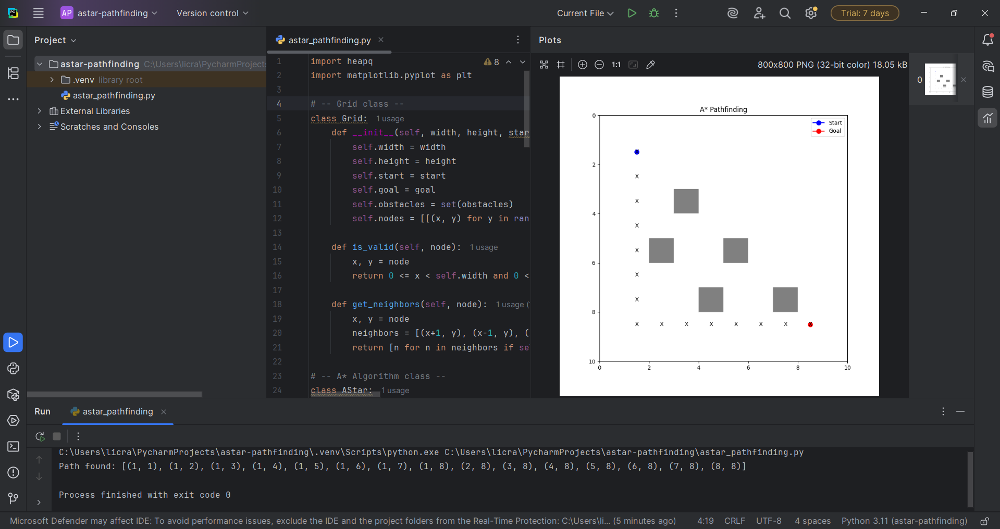

# A-Pathfinding-Visualization
This project demonstrates the A* Search Algorithm for finding the shortest path in a grid with obstacles. It uses Python and matplotlib to visualize the grid, obstacles, start/goal nodes, and the resulting path.
## Features

- Configurable grid size, start and goal positions, and obstacles
- Simple, readable code structure with classes
- Clear grid/path visualization using matplotlib
- Easily modifiable for new layouts or features

## Requirements

- Python 3.x
- matplotlib

Install requirements with: pip install -r requirements.txt

## Usage

Clone the repository, then run: python astar_pathfinding.py

## Example Visualization

- Gray squares: Obstacles
- Blue circle: Start node
- Red circle: Goal node
- X marks: Path found by the algorithm

## License

This project is open source and free to use for educational purposes
